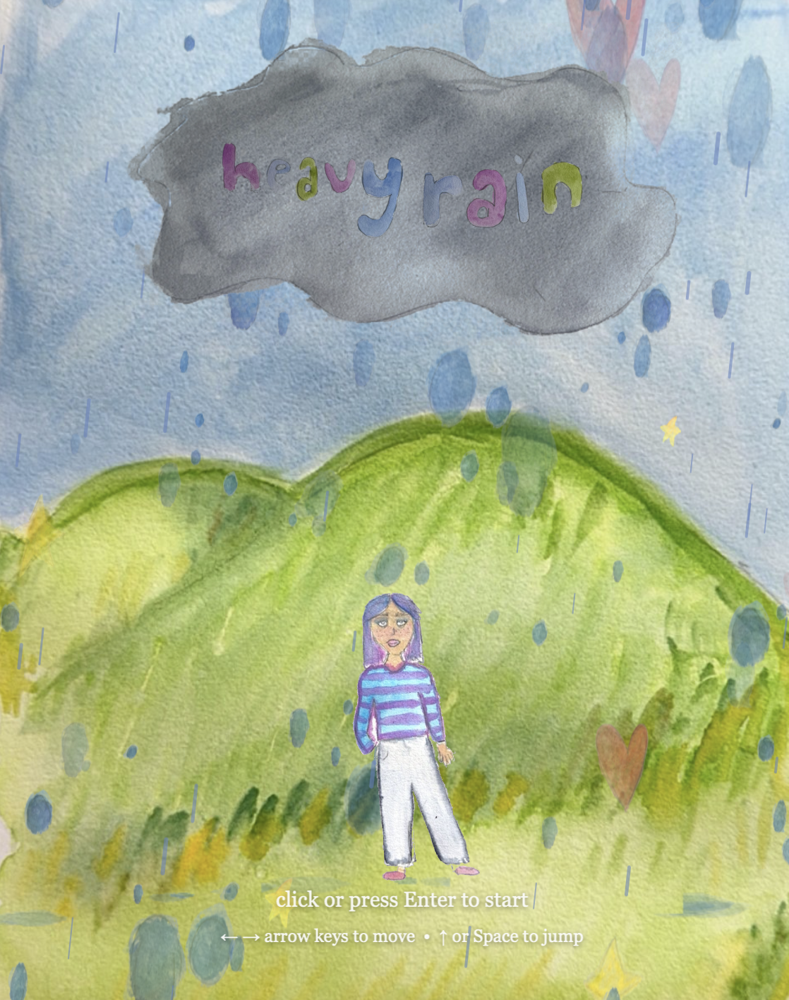

# heavy rain

A hand-painted browser game. Stand in the rain and catch the falling stars — but don't miss too many.

**[Play here](https://paigemca.github.io/heavyrain/heavyrain.html)**

## how to play

Blue raindrops are decoration — ignore them. Watch for the **stars** and **hearts** falling from the cloud.

- **Stars** — catch to score a point. Miss one and you lose a life.
- **Hearts** — rare. Catch one to restore a life. Missing costs nothing.

You start with 3 lives. The rain gets heavier and the sky darkens the longer you survive.

**Desktop**
- `←` `→` arrow keys to move
- `↑` or `Space` to jump (double jump supported)
- `Enter` or click to start

**Mobile**
- Tap the **left** or **right** side of the screen to move
- Tap the **centre** of the screen to jump (double jump supported)
- Tap anywhere to start
